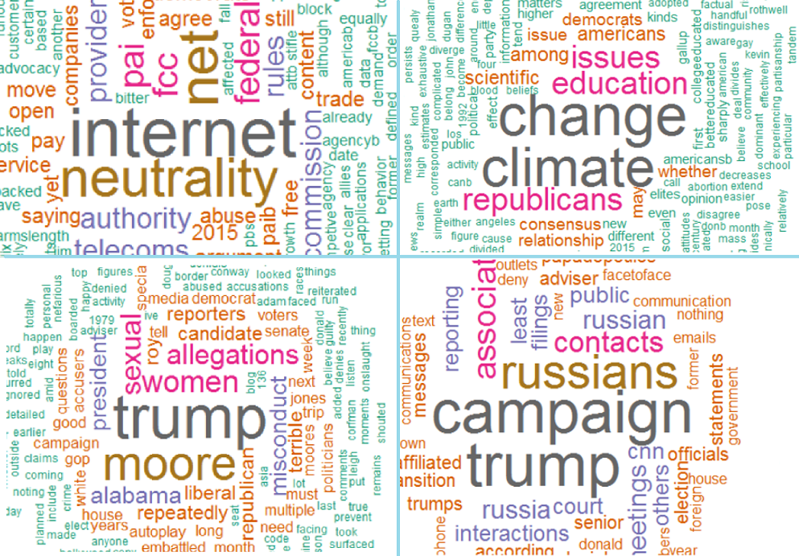
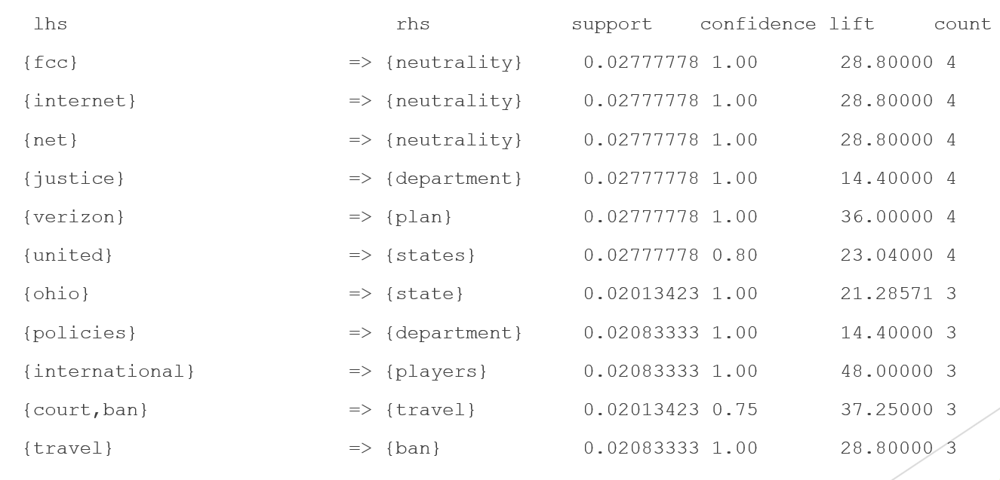
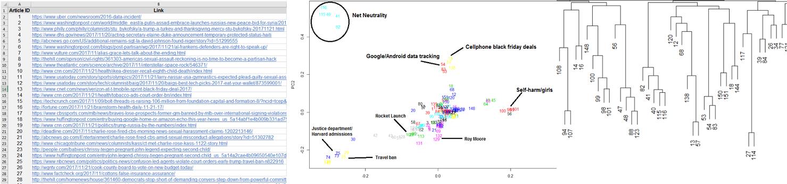

#### Exploring a news corpus in R

This repository houses the data files and code for my final project in IST 565 - Data Mining.

The R programming language was used to perform data analysis on a self-collected set of 151 news articles from Google News.

The news corpus was analyzed using: 

* Word clouds based on token frequency

* [Association rules](https://en.wikipedia.org/wiki/Association_rule_learning) to discover important relationships among words

* k-means clustering to explore article similarity
  * For this task, each article was assigned a unique number, which could be explored using a 2D plot (using [PCA](https://en.wikipedia.org/wiki/Principal_component_analysis) for dimensionality reduction) and a cluster dendrogram. 

